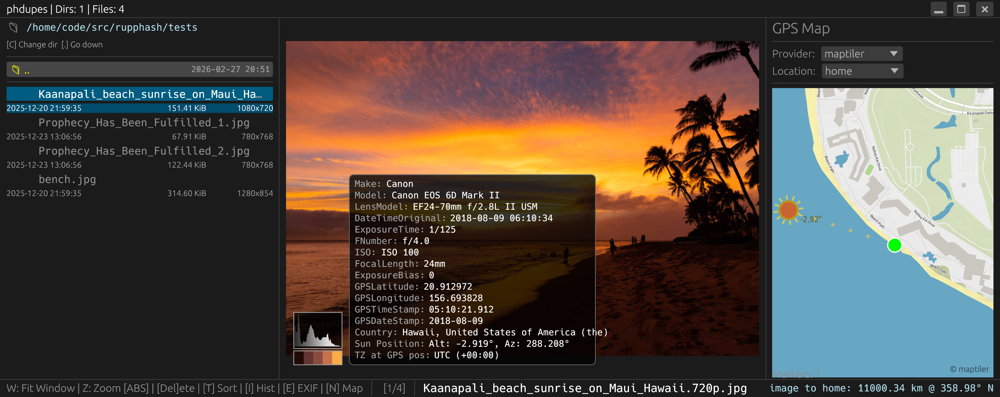
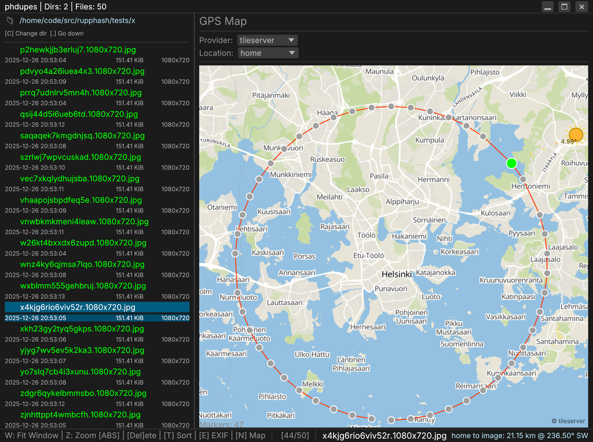
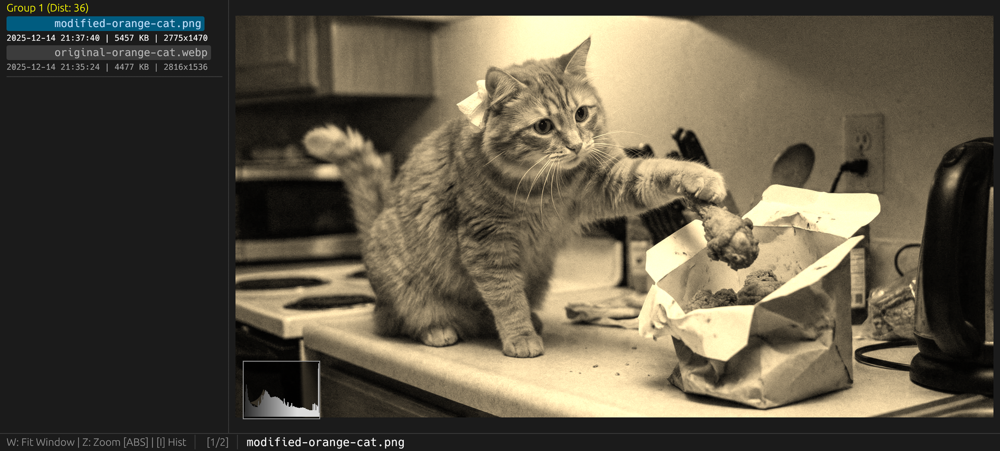
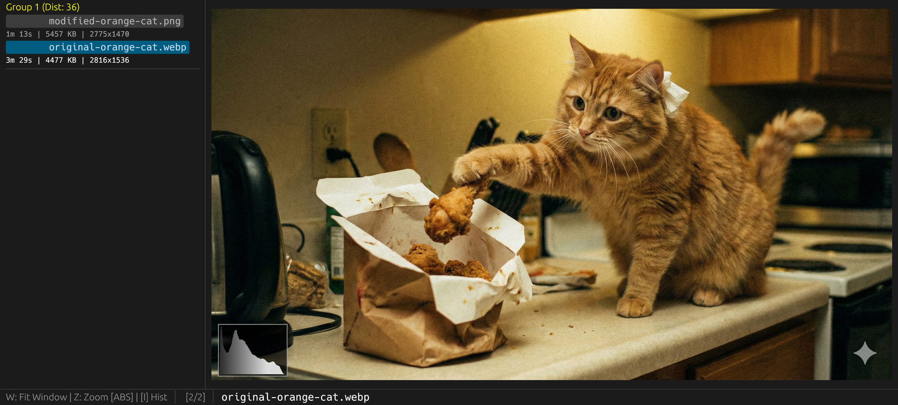

phdupes
=======

`phdupes`: Rust duplicate image detector using standard phash (perceptual image
hash) and pdqhash implementations, includes phdupes app: rust GUI (egui) and
TUI (ratatui)  for viewing and interacting with found duplicates, multithreaded
scanning and (also RAW) image processing, configurable preload of images,
metadata caching (encrypted with XChaCha20Poly1305, LMDB database),
Search inside Exif tags (also supports derived values like Country (from GPS location),
and Sun Azimuth, Sun Altitude (from GPS date, location, and the location’s timezone).

A million files takes about 2.5 GiB of memory.
500,000 files takes about 15-20s to Group on a modern CPU (after all the data has been loaded).
For hard-linked files PDQ features is stored only once (per file data) in memory.

Duplicates can be found by content (perceptual), or idendical pixel data
(--pixel-hash converts data to 16bit values for comparison),
or whole file comparison (bit-identical, using blake3).

## GPS Map
Examples:
```
[map_providers]
tileserver = "http://127.0.0.1:17766/styles/basic-preview/{z}/{x}/{y}@2x.png"
maptiler = "https://api.maptiler.com/maps/topo-v4/{z}/{x}/{y}@2x.png?key=GETYOUROWN"
```

If you have `/mydata/tiles/finland.mbtiles` generated with
`java -Dhttps.proxyHost=127.0.0.1 -Dhttps.proxyPort=3128 -Xmx4g -jar planetiler.jar --download --area=finland --output=finland.mbtiles`:

```bash
podman run --rm -it --log-driver k8s-file -p 17766:17766 -v "/mydata/tiles:/data:z" maptiler/tileserver-gl -b 0.0.0.0 -p 17766 --file /data/finland.mbtiles
```
Open http://127.0.0.1:17766/ to view supported styles.

You can also use pmtiles: install go-pmtiles from `https://github.com/protomaps/go-pmtiles` and then command
```bash
go-pmtiles extract https://build.protomaps.com/$(date --utc "+%Y%m%d" -d yesterday).pmtiles world_z11.pmtiles --maxzoom=11
```
makes a 7 GiB world "overview" file with maxzoom 11. Every zoom level you add doubles the data.

tileserver-gl needs configuration to make it serve raster maps.
```bash
cd /data
rm -rf fonts sprites tmp && mkdir tmp && cd tmp && \
  rget https://github.com/protomaps/basemaps-assets/archive/refs/heads/main.tar.gz && \
  tar xf basemaps-assets-main.tar.gz && \
  mv basemaps-assets-main/{fonts,sprites} .. && \
  cd .. && rm -rf tmp
```
Serve the data:
```podman run --rm -it --log-driver k8s-file -p 17766:17766 -v "/mydata/tiles:/data:z" maptiler/tileserver-gl -b 0.0.0.0 --verbose -p 17766 --config /data/config_z11.json```
`phdupes.conf`:
```
[map_providers]
tileserver = "http://127.0.0.1:17766/styles/map/{z}/{x}/{y}@2x.png"
```

example style_z11.json and config_z11.json are provided for offline serving.

## The fonts
To get the latest
```bash
curl -s 'https://api.github.com/repos/be5invis/Sarasa-Gothic/releases/latest' | jq -r ".assets[] | .browser_download_url" | pcre2grep "/Sarasa-TTC-Unhinted-.*7z$" | xargs -n 1 curl -L -O --fail --silent --show-error --
7z e Sarasa-TTC-Unhinted-*.7z
fc-query --format='%{index}: %{family} %{style}\n' Sarasa-Regular.ttc | pcre2grep "Sarasa (Term|UI) SC"
7: Sarasa UI SC,更纱黑体 UI SC Regular
25: Sarasa Term SC Regular
```

Configuration:
[gui]
font_monospace = "/usr/share/fonts/misc/Sarasa/Sarasa-Regular.ttc"
font_ui = "/usr/share/fonts/misc/Sarasa/Sarasa-Regular.ttc"

You can also embed it into binary so font configuration is not needed:
`cargo build --release --features embed-fonts`

## LFS
Using git-lfs now.  For a smaller clone without LFS files:
`GIT_LFS_SKIP_SMUDGE=1 git clone https://github.com/Safari77/rupphash.git`
Fetch what you need:
`git lfs pull --include="assets/fonts"`
(This is a placeholder notice, I am not currently using LFS.)

## Windows
If you want to use the GNU Toolchain (MinGW):

Install MSYS2: https://www.msys2.org/
Open "MSYS2 UCRT64" terminal (should be now in Start Menu)
*Note*: SHIFT-INSERT is paste operation by default
Run `pacman -S mingw-w64-x86_64-toolchain` (needs about 900 MiB)
`ls /c/msys64/mingw64/bin/dlltool.exe` show show the execuble.
Add `C:\msys64\mingw64\bin` into system Path environment.

Then back to rupphash directory!
```bash
rustup target add x86_64-pc-windows-gnu
cargo build --target x86_64-pc-windows-gnu
```

You might need to disable HEIF and/or rsraw manually, or you could use MSVC target.

By default a dynamically linked binary is built.
However, the dll's need to be in the same directory as the executable:
`Get-ChildItem -Path .\target\release\build -Filter *.dll -Recurse | Copy-Item -Destination .\target\release -Force`
If you want to build a static binary, check out `.github/workflows/build-windows.yml`.

Microsoft Visual C++ Redistributable latest supported downloads:
https://learn.microsoft.com/en-us/cpp/windows/latest-supported-vc-redist
https://aka.ms/vc14/vc_redist.x64.exe

*Note*:
MSVC Target: uses the linker built into Visual Studio (link.exe).

GNU Target: Uses the GNU linker (ld.exe) and tools (dlltool.exe).
Rust does not bundle these; it expects you to provide them.

## Optimizations
Add to `.cargo/config.toml`:
```
[build]
rustflags = ["-C", "target-cpu=native"]
```

## Screenshot - View mode


*Connect GPS locations*


## Screenshot - Duplicate finding mode


